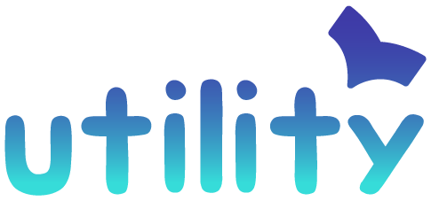

<div align="center">



# KS-Works Utility Portal

**사내 업무용 Windows 데스크톱 유틸리티 포털**
필요한 도구를 하나의 앱에 모아, GitHub 배포 + 자동 업데이트로 무인 유지관리합니다.


</div>

---

## 📦 설치

> **[⬇️ 최신 설치본 다운로드 (KS-Works-Utility-Setup.exe)](https://github.com/great-yob/KS-Works-Utility/releases/latest/download/KS-Works-Utility-Setup.exe)**

- 관리자 권한 불필요 — 사용자 폴더에 설치되며, 이후 **자동 업데이트**됩니다(실행 시 + 6시간마다).
- 모든 처리는 **로컬에서만** 수행됩니다 — 어떤 파일도 외부로 전송되지 않습니다.

<details>
<summary>⚠️ 최초 설치 시 SmartScreen / 백신 경고가 뜬다면</summary>

코드 서명 인증서가 없는 사내 자체 앱이라 처음 1회 경고가 날 수 있습니다(자동 업데이트는 영향 없음).
- **SmartScreen**: "추가 정보" → "실행"
- **사내 중앙관리 백신**: IT에 예외(허용) 등록 요청이 가장 확실합니다.
</details>

---

## ✨ 유틸리티

| | 기능 |
|---|---|
| 📄 **PDF 압축기** | Ghostscript로 **목표 용량**(2/5/10MB/직접 입력)에 맞춰 반복 재인코딩 — 목표 이하 최고 화질로 수렴, 원본 옆에 `압축_이름.pdf` 저장 |
| 🖼️ **이미지 변환기** | PNG·TIF·SVG·WEBP·GIF·WMF/EMF 등을 **JPG로 일괄 변환** — 폴더 드롭 시 하위 폴더까지 재귀 스캔, DPI 선택 |
| 📝 **삽입그림 정리기** | **HWP/HWPX 문서 안의 모든 그림을 JPG로 정리** — WMF/EMF 차트로 인한 레이아웃 깨짐·용량 문제 해결, 잉여 픽셀 자동 다운사이즈(사이즈 조정), 원본 옆에 `변환_이름.hwp(x)` 저장 |

WMF/EMF는 Windows GDI/GDI+로 한글과 동일하게 렌더링합니다 (Windows 전용인 이유). UI·로그는 한국어입니다.

---

## 🛠️ 개발

```powershell
npm install
npm run dev              # 개발 서버 (http://localhost:3000)
npm run lint             # 타입 체크 (tsc --noEmit)
npm run dev:electron     # 빌드 후 Electron 실행
npm run release          # 버전 올린 뒤 GitHub Releases 자동 게시 (GH_TOKEN 필요)
```

**구조**: Express 서버(`server.ts`) + Electron 셸(`electron-main.ts`) + Python 워커(`python_worker/`, PyInstaller exe·NDJSON 스트리밍). 포털은 레지스트리 기반이라 유틸 추가는 페이지 1개 + 레지스트리 1줄입니다.

- 새 유틸리티 추가: [docs/유틸리티_추가_가이드.md](docs/유틸리티_추가_가이드.md)
- 배포/자동 업데이트: [docs/자동업데이트_배포_가이드.md](docs/자동업데이트_배포_가이드.md)
- 코드베이스 상세: [CLAUDE.md](CLAUDE.md)

`Electron` · `React 19` · `Vite` · `TypeScript` · `Tailwind v4` · `Express` · `Ghostscript` · `Python (Pillow/GDI+)`

---

<div align="center">

© kim daekyung

</div>
